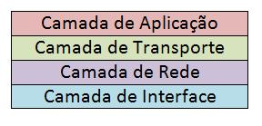

# Internet Explained

## Links Úteis e Bibliografia Utilizada

- [The internet, explained - Vox](https://www.vox.com/2014/6/16/18076282/the-internet)

- [O que é TCP/IP? - Tecmundo](https://www.tecmundo.com.br/o-que-e/780-o-que-e-tcp-ip-.htm)

- [O que é IPv6](https://www.infowester.com/ipv6.php)

### O que é Internet?

Internet é, nos dias atuais, uma rede global de computadores. Começou como um projeto de pesquisa acadêmico em 1969, e com o tempo, virou uma rede mundial que conecta o mundo inteiro.

A internet é muito facilmente confundida com a web, porém, a web é apenas uma das aplicações da internet, outros exemplos de aplicações são: email e BitTorrent.

### Quem criou a Internet

A internet começou com a [ARPANET](https://pt.wikipedia.org/wiki/ARPANET), uma rede de pesquisa acadêmica, que foi fundada pelos militares americanos. No início, por conta da guerra fria, foi usada para o armazenamento seguro e troca de informações entre sedes militares. Desde seu início, em 1969, a internet teve várias melhorias, uma delas foi a criação do protocolo [TCP/IP](https://pt.wikipedia.org/wiki/TCP/IP) no ano de 1973, mas apenas no ano de 1983 foi que a ARPANET adotou o protocolo.

### O Protocolo TCP/IP

De forma resumida, o TCP/IP é o principal protocolo de envio e recebimento de dados na internet. TCP significa _Transmission Control Protocol_ (Protocolo de Controle de Transmissão) e o IP, _Internet Protocol_ (Protocolo de Internet).

O Protocolo é uma espécie de linguagem utilizada para que dois computadores consigam se comunicar. Por mais que duas máquinas estejam conectadas à mesma rede, há a necessidade delas falarem a mesma "língua", e o TCP/IP é justamente usada como "idioma", auxiliando assim, para que as aplicações possam conversar entre si.

#### Pilha de Protocolos

O TCP/IP é um conjunto de protocolos. Estes protocolos são divididos em quatro camadas: **Aplicação**, **Transporte**, **Rede** e **Interface**. Cada uma delas é responsável pela execução de tarefas distintas, e essa divisão é uma forma de garantir a integridade dos dados que trafegam pela rede.

- Aplicação

Essa camada é utilizada pelos programas para enviar e receber informações de outros programas através da rede. Nela você encontra protocolos como [SMTP (para email)](https://www.hostgator.com.br/blog/o-que-e-protocolo-smtp/), [FTP (Transferência de arquivos)](https://pt.wikipedia.org/wiki/Protocolo_de_Transfer%C3%AAncia_de_Arquivos) e o mais conhecido [HTTP (Para navegar na internet)](https://pt.wikipedia.org/wiki/Hypertext_Transfer_Protocol). Assim que os dados são processados pela camada de aplicação, eles são enviados para a próxima divisão.

- Transporte e Rede

A camada de transporte é responsável por receber os dados enviados pela cama de Aplicação, verificar a integridade deles e dividi-los em pacotes. Após essas tarefas, as informações são encaminhadas para a camada internet, que é a próxima camada.

Na Rede, os dados empacotados são recebidos e anexados ao endereço virtual (IP) do computador remetente e do destinatário. Agora é a vez dos pacotes serem, enfim, enviados pela internet. Para isso, são passados para a camada Interface.

- Interface

A tarefa da Interface é receber e enviar pacotes pela rede. Os protocolos utilizados nessa camada dependem do tipo de rede que está sendo utilizado. Atualmente, o mais comum é o Ethernet, disponível em diferentes velocidades.

#### Conclusão para o TCP/IP

Todas as camadas e protocolos citados acima fazem parte do TCP/IP. É assim que ele trabalha, em etapas. Apesar de serem muitas informações, o importante é ter em mente que o TCP/IP é utilizado para a **transferência de informações** pela rede entre computadores.

Vamos resumir então os processos que ocorrem, primeiro há o recebimento das informações (camada de aplicação), depois elas são empacotadas para o formato da rede (transporte). Por fim, os dados são endereçados (rede) e enviados (interface).

### O que é um Endereço de IP

Endereços de Protocolos da Internet são números que os computadores usam para identificar uns aos outros na internet.

Um departamento [ICANN](https://pt.wikipedia.org/wiki/Corpora%C3%A7%C3%A3o_da_Internet_para_Atribui%C3%A7%C3%A3o_de_Nomes_e_N%C3%BAmeros) conhecido como __Autoridade de Números Atribuídos à Internet__, que é responsável pela distribuição de endereços de IP para assegurar que duas organizações diferentes não usem o mesmo endereço.

### O que é IPv6?

- Endereço IP

Para entender melhor o que é IPv6, precisamos entender a sua versão anterior, o IPv4, que convencionamos chamar apenas de IP. O IPv4 é composto por uma sequência numérica no seguinte formato: **x.x.x.x**, onde x é um número que pode ir de 0 a 255, por exemplo:

**189.34.242.229**

Quando você contrata uma empresa para fornecer acesso à internet à sua residência, por exemplo, o provedor irá fornecer um endereço IP de sua cota (em boa parte dos casos, esse endereço muda a cada conexão) para conectar seu computador ou sua rede à internet. Websites também têm endereço IP, afinal, ficam armazenados em servidores que, obviamente, estão conectados à internet.

O formato do IPv4 é uma sequência de 32 bits (ou quatro conjuntos de 8 bits) e isso permite, teoricamente, a criação de até 4.294.967.296 endereços. É uma quantidade grande, mas como hoje em dia cada dispositivo (Computador, smartphone, tablet e etc.), deve ter um IP, esse número acaba se tornando insuficiente conforme passa o tempo.

Esse problema existe porque a internet não foi planejada de forma a ser tão grande. A ideia original era a de se criar um sistema de comunicação que interligasse centros de pesquisa. Somente quando a internet passou a ser utilizada de maneira ampla é que ficou claro que o número máximo de endereços IP poderia ser atingido em um futuro relativamente próximo. Foi a partir desta percepção que o projeto IPng (_Internet Protocol next generation_) teve início, dando origem ao que conhecemos como IPv6.

- Endereços IPv6

A criação do IPv6 consumiu vários anos, afinal, uma série de parâmetros e requisitos necessita ser observada para que problemas não ocorram ou, pelo menos, para que sejam substancialmente amenizados em sua implementação. Em outras palavras, foi necessário fazer o IPv4 evoluir, e não criar um padrão completamente novo.

A primeira diferença que se nota entre o IPv4 e o IPv6 é o seu formato: o primeiro é constituído por 32 bits, como já informado, enquanto que o segundo é formado por 128 bits. Com isso, teoricamente, a quantidade de endereços disponíveis pode chegar a 340.282.366.920.938.463.463.374.607.431.768.211.456, o que torna uma possibilidade extraordinariamente alto em relação à criação de IPs, essa é uma grande diferença entre os dois tipos de endereços, mas existem mais diferenças, caso queira entender mais a fundo, visite os seguintes link:

- [IPv6.br](http://ipv6.br/)
- [IPv6 Forum](https://www.ipv6forum.com/)
- [IPv6 Wikipédia](https://pt.wikipedia.org/wiki/IPv6)
- [TCP/IP (v4 and v6) Technical Reference - Microsoft](https://docs.microsoft.com/en-us/previous-versions/windows/it-pro/windows-server-2008-R2-and-2008/dd379473(v=ws.10)?redirectedfrom=MSDN)
